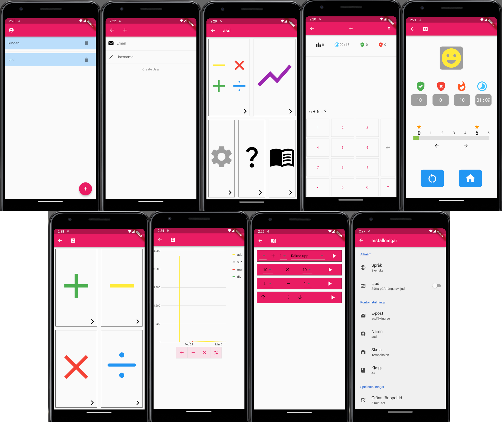
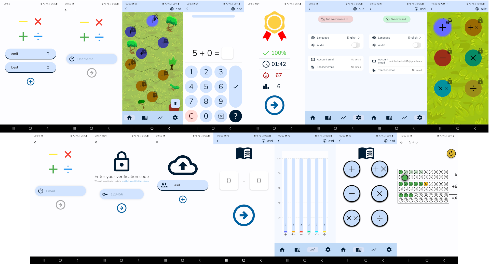

# Optimalt Lärande

Projektet Optimalt Lärande består av en app, "OLLE", för Android och iOS, utvecklad i Flutter, med ett tillhörande backend-system.
Appens huvudsakliga syfte är att barn ska kunna lära sig entalsaritmetik på ett snabbare och mer underhållande sätt,
och använder sig av en smart optimeringsalgoritm för att välja uppgifter. Optimeringsalgoritmen har utvecklats av projektets
kund, Jörgen Blomvall.

## Kandidatprojekt i programvaruutveckling (TDDD96, LiU)

Detta projekt har utvecklats av tre kandidatgrupper i kursen TDDD96, Kandidatprojekt i programvaruutveckling.
PUM11-2022 har utvecklat den första versionen av appen i Flutter, med inspiration från en tidigare Android-app
utvecklad av kunden (se mappen [kund-android-projekt](./kund-android-projekt/)).
PUM09-2023 har vidareutvecklat appen, främst gällande widgets för visualisering av räknesätt med olika pedagogiska inlärningsmetoder.
PUM09-2024 har vidareutvecklat appen främst genom att designa om det grafiska gränssnittet och integrera två nya räknesätt
från kundens optimeringsalgoritm, addition och multiplikation med okänd variabel.
Dessutom har PUM09-2024 implementerat ett mer lättanvänt profilsystem som inte kräver internet eller en e-postadress för att börja räkna,
och ett kontosystem som i framtiden (när optimeringskoden har utökats för att stödja detta) kan användas för att synkronisera framsteg
mellan olika enheter. PUM09-2024 har även implementerat en REST-API med CSV som svarsformat, enligt önskemål från kunden.

## Bilder

Några bilder från hur appen såg ut efter PUM09-2023:

Några bilder från hur appen såg ut efter PUM09-2024:

## Installation

För instruktioner gällande installation och hur man kommer igång med utveckling app appen och backend-systemet,
se [frontend/README.md](./frontend/README.md) respektive [backend/README.md](./backend/README.md).

## Användning
Med Android Studio är det möjligt att emulera en mobiltelefon med applikationen. I Android Studio går det att enkelt testa både funktionalitet och design av Optimalt Lärande. Det är även möjligt att föra över applikationen från Android Studio till en fysisk enhet.

## Framtida möjligheter
Det finns potential att implementera fler spelifieringselement, t.ex. en avatarsida, multiplayer funktionalitet, eller valfrihet avseende färgtema på appen för användaren, m.m.
Gällande visualiseringen går det att fortsätta designa och implementera olika pedagogiska metoder för de olika räknesätten.

## Licens
Apache 2.0 licens är tillagd i git-repo. Notera dock att kundens optimeringskod, `optQuestions.h`, inte har en öppen källkodslicens, så projektet i sin nuvarande form bör inte publiceras som open-source. 
