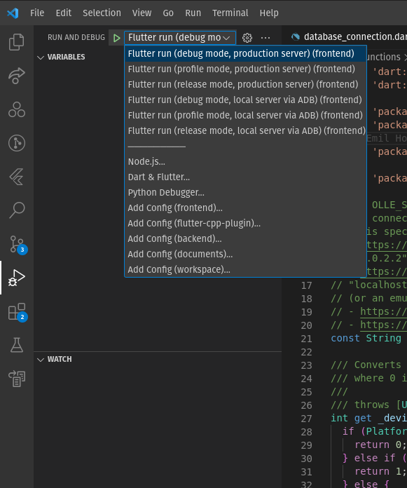

# Frontend

Denna modul innehåller ett frontend-system i form av en Android- och iOS-app,
som byggs med ramverket Flutter, version 3.19. Appen innehåller ett grafiskt gränssnitt där
användaren kan träna på matematikuppgifter som väljs av en
[optimeringsalgoritm skriven i C++](../flutter-cpp-plugin/), och kommunicerar
med [backend-systemet](../backend/) för att lagra statistik och erbjuda
utökad funktionalitet.

## Uppstartsguide

Nedan följer en guide som hjälper dig att komma igång med utveckling av appen.

1. Installera och konfigurera nödvändiga ramverk, vilket beskrivs i [installationsguiden](./INSTALLATION_GUIDE.md).

2. Ställ dig i mappen [frontend](./) och kör kommandot `flutter pub get` för att hämta appens flutter-bibliotek.

3. Ställ dig i mappen [flutter-cpp-plugin](../flutter-cpp-plugin/) och kör kommandot `flutter pub get`
för att hämta optimeringsmodulens flutter-bibliotek.

4. Testa att [kompilera och köra](#hur-man-kompilerar-installerar-och-kör-appen) appen.

## Hur man kompilerar, installerar och kör appen

Nedan följer exempel på vanliga kommandon som används för att kompilera, installera och köra appen.
Notera att du i alla nedanstående kommandon kan använda flaggan `--debug`, `--profile` eller `--release` för att
[välja vilket byggläge du vill kompilera appen med](https://docs.flutter.dev/testing/build-modes).
Standardvalet är `--debug` när du kör `flutter run`, och `--release` annars.

> **OBS!** Alla dessa kommandon utgår från att du arbetar i samma mapp som denna README-fil ligger i.

> **OBS!** Du måste ha en Android- eller iOS-enhet (fysisk eller emulator) ansluten för att kunna installera eller köra appen
(annars kan du bara kompilera). Kontrollera att du har en enhet ansluten genom att köra kommandot `flutter devices`.

Kompilera, installera och kör appen:

```
flutter run
```

> **OBS!** Om du använder Visual Studio Code som utvecklingsmiljö kan du även använda menyn "Run and Debug",
> (se bild nedan) vilket gör att du kan stega igenom koden med hjälp av debug-verktygen i Visual Studio Code.
> Dessutom kan du på ett smidigt sätt välja byggläge och byta mellan att ansluta till produktionsservern
> eller en lokal server.



Kompilera och installera appen:

```
flutter install
```

Kompilera appen till en APK-fil (för Android):

```
flutter build apk
```

Kompilera apppen till en IPA-fil (för iOS):

```
flutter build ipa
```

## Hur man ansluter appen mot en lokal server

När du kompilerar appen kommer adressen till backend-servern som standard att sättas till
produktionsserverns adress. Om du vill ansluta till en lokal server kan du använda
flaggan `--dart-define OLLE_SERVER=<adress>`, och ersätta `<adress>` med en URL för den
lokala serverns HTTP-basadress (t.ex. `http://localhost:8088`). Om du använder en Andrioid-emulator
kan du använda IP-adressen `10.0.2.2` [för att ansluta till din dator](https://developer.android.com/studio/run/emulator-networking).
Om du istället vill ansluta en fysisk enhet till din lokala server behöver du ansluta båda
enheterna till samma nätverk, och sedan leta fram vilken IP-address din dator har på detta nätverk.

> **OBS!** På större, segmenterade nätverk (exempelvis **Eduroam**) kommer du troligen inte att kunna
> ansluta via din IPv4-adress, eftersom den ligger bakom NAT. Använd din IPv6-adress istället.

### Ett enklare sätt (enbart för Android)

Det finns ett enklare sätt att ansluta till en lokal server, som går ut på att använda ADB
för att vidarebefordra nätverkstrafik mellan din dator och en Android-enhet. Genom att köra
kommandot `adb reverse tcp:8088 tcp:8088` kan du ansluta till port `8088` på din dators nätverk
från port `8088` på din Android-enhet (genom att använda `--dart-define OLLE_SERVER=http://localhost:8088`).
Se dokumentationen för [adb forward](https://developer.android.com/tools/adb#forwardports) och
[adb reverse](https://android.googlesource.com/platform/system/core/+/252586941934d23073a8d167ec240b221062505f) för mer detaljer.

> **OBS!** Om du får ett fel som lyder `error: more than one device/emulator` när du kör `adb reverse ...`
> är det förmodligen för att du har konfigurerat både en fysisk enhet och en emulator, och ADB vet inte vilken av dem du menar.
> Det enklaste sättet att lösa det på är att använda `-d`-flaggan (för fysisk enhet) eller `-e`-flaggan (för emulator),
> t.ex. `adb -d reverse ...` eller `adb -e reverse ...`.

Allt detta sker redan helt automatiskt om du använder "Run and Debug"-menyn i Visual Studio Code
(se ["Hur man kompilerar, installerar och kör appen"](#hur-man-kompilerar-installerar-och-kör-appen)),
och väljer något av alternativen "local server via ADB".

## Övriga upplysningar från tidigare utvecklare

Nedan följer övriga upplysningar från tidigare utvecklare (2022 grupp 11 och 2023 grupp 9).
**Informationen kan vara inaktuell** och har inte ännu verifierats.

### Uppdatering av Nativelib

När uppdateringar har skett i **Nativelib** så måste det nya versionen tas ner. Detta görs lättast genom:
```
$ flutter clean
$ flutter pub get
$ flutter packages upgrade
```

Notera att **Nativelib** är definerat i `pubspec.yaml`, där en specifik *branch*, *tag* eller *commit* skulle kunna användas. Nuvarande implementation tar bara senaste versionen. För att använda en lokal version av biblioteket kan `path:` användas istället för `git`. Pathen kan vara absolut eller relativ `frontend`-mappen.

###  Ändra appikon och namn på appen

Paketet [flutter_launcher_icons](https://pub.dev/packages/flutter_launcher_icons) kan användas för att generera de nödvändiga bild filerna för både Android och iOS. 

Lägg till det som en development dependency och konfiguera i `pubspec.yaml`.

Exempel visas nedan:

```
flutter_launcher_icons: ^0.9.2

flutter_icons:
  android: "launcher_icon"
  ios: true
  image_path: "PATH_TO_LAUNCHER_ICON"
```

Sedan kan `flutter pub run flutter_launcher_icons:main` köras för att skapa bilderna.

Paketet [flutter_app_name](https://pub.dev/packages/flutter_app_name) kan användas för att ändra namnet på appen.

### Lokalisering
[flutter.dev](https://docs.flutter.dev/development/accessibility-and-localization/internationalization) har en bra guide för hur detta kan gå till.
